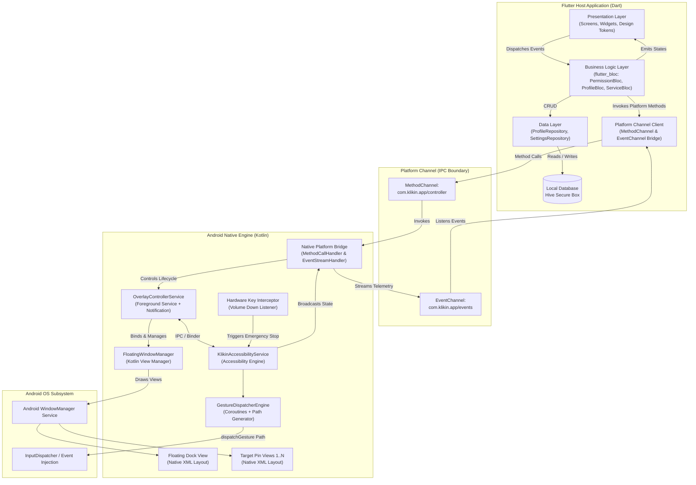
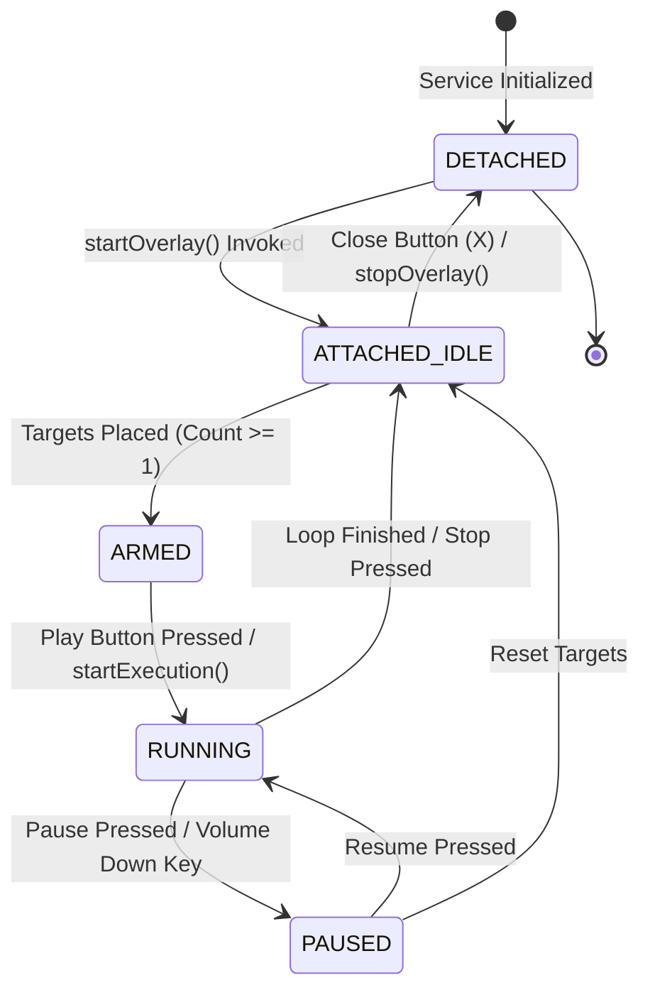

# Technical Architecture Document (ARCHITECTURE.md) — Klikin

* **Sistem:** Klikin Mobile Screen Automation Engine
* **Platform Target:** Android 7.0+ (API Level 24+)
* **Tech Stack:** Flutter (UI & Business Logic) + Kotlin Native (`AccessibilityService`, `WindowManager`)
* **Arsitektur:** Hybrid Clean Architecture & Unidirectional IPC Platform Bridge
* **Dokumen Versi:** 1.0.0
* **Status:** Final Architectural Specification

---

## 1. High-Level Architecture Diagram

Klikin menggunakan pemisahan tanggung jawab yang ketat (*Separation of Concerns*). Layer Dart bertanggung jawab penuh atas antarmuka pengguna utama, manajemen status (*state management*), dan persistensi data lokal. Layer Kotlin Native bertanggung jawab murni atas siklus hidup *floating window overlay*, deteksi interaksi layar, serta injeksi gestur otomatis via Android Accessibility Subsystem.



---

## 2. IPC / Platform Channel Contract

Komunikasi antara Flutter dan Kotlin dilakukan secara asinkron melalui kontrak tipe data (*type-safe contract*) yang ketat. Dilarang mengubah nama channel, method, atau parameter tanpa konsensus pembaruan dokumen ini.

### 2.1 Identitas Channel
* **MethodChannel:** `com.klikin.app/controller` (Flutter $\to$ Android Native)
* **EventChannel:** `com.klikin.app/events` (Android Native $\to$ Flutter Event Stream)

---

### 2.2 MethodChannel Specification (Invocations)

| Method Name | Input Arguments (Map) | Return Type | Kemungkinan Error Codes | Deskripsi |
| :--- | :--- | :--- | :--- | :--- |
| `checkPermissions` | `null` | `Map<String, Boolean>` | - | Mengembalikan status `hasOverlayPermission` dan `hasAccessibilityPermission`. |
| `requestOverlayPermission`| `null` | `Boolean` | `ERR_INTENT_FAILED` | Membuka `ACTION_MANAGE_OVERLAY_PERMISSION`. |
| `requestAccessibilityPermission`| `null` | `Boolean` | `ERR_INTENT_FAILED` | Membuka `ACTION_ACCESSIBILITY_SETTINGS`. |
| `startOverlay` | `Map<String, dynamic>` (Payload Profil) | `Boolean` | `ERR_NO_PERMISSION`, `ERR_SERVICE_DEAD` | Menampilkan floating dock dan target pins di layar. |
| `stopOverlay` | `null` | `Boolean` | `ERR_OVERLAY_NOT_ACTIVE`| Menghapus seluruh view dari WindowManager dan shutdown service. |
| `syncTargets` | `List<Map<String, dynamic>>` | `Boolean` | `ERR_INVALID_COORDS` | Sinkronisasi daftar titik target dari Flutter ke native overlay. |
| `updateLoopConfig` | `Map<String, dynamic>` | `Boolean` | `ERR_INVALID_CONFIG` | Memperbarui parameter interval dan loop tanpa restart overlay. |
| `startExecution` | `null` | `Boolean` | `ERR_NOT_READY`, `ERR_NO_TARGETS` | Memulai siklus pengetukan otomatis berulang. |
| `pauseExecution` | `null` | `Boolean` | - | Menghentikan sementara siklus pengetukan. |
| `getServiceStatus` | `null` | `String` | - | Mengembalikan: `IDLE`, `ARMED`, `RUNNING`, `PAUSED`. |

---

### 2.3 EventChannel Specification (Native to Dart Telemetry)

Native layer melakukan *streaming event* real-time ke Flutter melalui JSON payload:

```typescript
type NativeEvent = 
  | { eventType: "STATE_CHANGED"; state: "IDLE" | "ARMED" | "RUNNING" | "PAUSED" | "ERROR"; message?: string }
  | { eventType: "TARGET_COORDINATES_CHANGED"; index: number; x: number; y: number }
  | { eventType: "EXECUTION_PROGRESS"; currentLoop: number; totalLoops: number; targetIndex: number }
  | { eventType: "EMERGENCY_STOP"; reason: "VOLUME_KEY_TRIGGERED" | "SCREEN_OFF" | "USER_ABORT" }
  | { eventType: "SERVICE_DISCONNECTED"; reason: string };
```

---

### 2.4 Payload Schemas (Data Transfer Objects)

#### Payload Input `startOverlay`:
```json
{
  "profileId": "prf_8f93e1a0",
  "profileName": "Farming Dungeon",
  "mode": "MULTI_POINT",
  "loopConfig": {
    "loopType": "FINITE_COUNT",
    "maxCount": 1000,
    "durationMinutes": null
  },
  "targets": [
    {
      "index": 1,
      "x": 450,
      "y": 1200,
      "pressDurationMs": 50,
      "delayAfterMs": 400
    },
    {
      "index": 2,
      "x": 720,
      "y": 1850,
      "pressDurationMs": 50,
      "delayAfterMs": 800
    }
  ]
}
```

---

## 3. Native Engine Design (Kotlin Subsystem)

### 3.1 WindowManager Architecture & Lifecycle

WindowManager bertanggung jawab atas rendering antarmuka melayang di atas aplikasi lain menggunakan layout XML murni (menghindari overhead RAM Flutter Engine).

```
+-------------------------------------------------------------------------+
|                      WindowManager View Hierarchy                       |
|                                                                         |
|  [Layer 1: Target Pins Container]                                       |
|  - LayoutParams.TYPE_APPLICATION_OVERLAY                                |
|  - FLAG_NOT_FOCUSABLE | FLAG_LAYOUT_NO_LIMITS                           |
|  - Interactivity: Dynamic Touch Toggling                                |
|    * Saat IDLE/PAUSED : Normal touchable (bisa di-drag).                |
|    * Saat RUNNING     : FLAG_NOT_TOUCHABLE diaktifkan (Touch            |
|                         passthrough, klik tembus ke game).              |
|                                                                         |
|  [Layer 2: Floating Dock Container]                                     |
|  - LayoutParams.TYPE_APPLICATION_OVERLAY                                |
|  - FLAG_NOT_FOCUSABLE                                                   |
|  - Dimensi: 52dp x 240dp (Expanded) atau 36dp x 36dp (Collapsed)        |
|  - Interactivity: Touch Intercept Listener untuk Drag & Drop            |
+-------------------------------------------------------------------------+
```

#### State Machine Siklus Hidup Window Overlay:


---

### 3.2 Gesture Engine & Coroutine Loop Architecture

Injeksi ketukan diatur oleh `GestureDispatcherEngine` yang terikat pada instance `KlikinAccessibilityService`.

#### Spesifikasi Eksekusi:
1. **Thread Isolation:** Seluruh kalkulasi jeda waktu dan pembentukan path berjalan di `CoroutineScope(Dispatchers.Default + SupervisorJob())`. UI Thread native dan Flutter Thread tidak pernah terblokir.
2. **Gesture Construction:**
   ```kotlin
   fun buildTapGesture(x: Float, y: Float, durationMs: Long): GestureDescription {
       val path = Path().apply { moveTo(x, y) }
       val stroke = GestureDescription.StrokeDescription(path, 0, durationMs)
       return GestureDescription.Builder().addStroke(stroke).build()
   }
   ```
3. **Sequential Execution Engine (Coroutines):**
   ```kotlin
   suspend fun executeSequence(targets: List<TargetPoint>, loopConfig: LoopConfig) {
       var completedLoops = 0
       while (isActive && isRunning) {
           for (target in targets) {
               if (!isRunning) break
               
               // Dispatch gesture via AccessibilityService callback
               val success = dispatchGestureSuspend(target.x.toFloat(), target.y.toFloat(), target.pressDurationMs)
               if (!success) {
                   emitEvent(NativeEvent.Error("Gesture dispatch rejected by OS"))
               }
               
               // Accurate delay interval
               delay(target.delayAfterMs)
           }
           
           completedLoops++
           if (loopConfig.isFinished(completedLoops)) {
               stopExecution()
               break
           }
       }
   }
   ```
4. **Hardware Emergency Killswitch:**
   Method `onKeyEvent` pada `KlikinAccessibilityService` menangkap event `KeyEvent.KEYCODE_VOLUME_DOWN`. Ketika terdeteksi, coroutine loop langsung di-cancel seketika (`job.cancel()`) dan status dipaksa menjadi `PAUSED`.

---

## 4. State Management & Data Flow (Flutter Layer)

Aplikasi Flutter menggunakan **BLoC (Business Logic Component)** dengan pustaka `flutter_bloc` untuk memisahkan UI deklaratif murni dari logika bisnis dan platform channel.

### 4.1 BLoC Ecosystem

1. **`PermissionBloc`:**
   * **State:** `PermissionState(overlayGranted: bool, accessibilityGranted: bool, isChecking: bool)`
   * **Events:** `CheckPermissionsEvent`, `RequestOverlayPermissionEvent`, `RequestAccessibilityPermissionEvent`.
   * **Tugas:** Menangani polling background saat pengguna kembali dari halaman Android Settings.

2. **`ProfileBloc`:**
   * **State:** `ProfileState(profiles: List<ClickProfile>, activeProfile: ClickProfile?, isLoading: bool)`
   * **Events:** `LoadProfilesEvent`, `CreateProfileEvent`, `UpdateProfileEvent`, `DeleteProfileEvent`, `SelectActiveProfileEvent`.
   * **Tugas:** Interaksi ke `ProfileRepository` berbasis storage lokal aman Hive.

3. **`ServiceBloc`:**
   * **State:** `ServiceState(status: ServiceStatus, isOverlayVisible: bool, activeTargets: List<TargetPoint>)`
   * **Events:** `LaunchOverlayEvent`, `TerminateOverlayEvent`, `SyncNativeTargetEvent`, `NativeStateChangedEvent`.
   * **Tugas:** Mengatur aliran pesan dua arah dengan `MethodChannel` dan mendengarkan stream `EventChannel`.

---

## 5. Blueprint Struktur Direktori Project

Struktur direktori wajib mengikuti arsitektur modular berikut:

```
klikin/
├── android/
│   └── app/
│       └── src/
│           └── main/
│               ├── AndroidManifest.xml
│               ├── res/
│               │   ├── layout/
│               │   │   ├── view_floating_dock.xml          # Layout dock melayang
│               │   │   ├── view_floating_dock_min.xml      # Layout dock ciut (bubble)
│               │   │   └── view_target_pin.xml             # Layout pin angka 1..N
│               │   ├── xml/
│               │   │   └── accessibility_service_config.xml # Konfigurasi flags accessibility
│               │   └── values/
│               │       ├── colors.xml                      # Palette sesuai Design Brief
│               │       └── styles.xml
│               └── kotlin/
│                   └── com/
│                       └── klikin/
│                           └── app/
│                               ├── MainActivity.kt         # Registrasi Flutter Platform Channel
│                               ├── bridge/
│                               │   ├── NativeMethodHandler.kt # Implementasi MethodCallHandler
│                               │   └── NativeStreamHandler.kt # Implementasi EventChannel Stream
│                               ├── service/
│                               │   ├── KlikinAccessibilityService.kt # Engine injeksi gestur
│                               │   └── OverlayControllerService.kt   # Foreground lifecycle service
│                               ├── overlay/
│                               │   ├── FloatingWindowManager.kt      # Manager addView / removeView
│                               │   ├── FloatingDockView.kt           # Controller interaksi dock
│                               │   └── TargetPinView.kt              # Controller drag pin & koordinat
│                               ├── engine/
│                               │   ├── GestureDispatcherEngine.kt    # Coroutine loop & Path builder
│                               │   └── CoordinateSanitizer.kt        # Boundary check & clamping
│                               └── model/
│                                   ├── NativeTargetPoint.kt          # DTO Target Point Kotlin
│                                   └── NativeLoopConfig.kt           # DTO Loop Config Kotlin
│
├── lib/
│   ├── main.dart                                           # Entry point Flutter
│   ├── core/
│   │   ├── constants/
│   │   │   ├── channel_constants.dart                      # Nama channel & method strings
│   │   │   └── storage_constants.dart                      # Hive box keys
│   │   ├── errors/
│   │   │   ├── exceptions.dart
│   │   │   └── failures.dart
│   │   ├── theme/
│   │   │   ├── app_colors.dart                             # Token warna (Obsidian, Emerald, dll)
│   │   │   ├── app_typography.dart                         # Token font Plus Jakarta Sans & JetBrains Mono
│   │   │   └── app_theme.dart                              # ThemeData Dark murni
│   │   └── utils/
│   │       └── boundary_cliper.dart                        # Utility clamping koordinat
│   ├── data/
│   │   ├── models/
│   │   │   ├── click_profile_model.dart                    # Hive adapter & JSON serializer
│   │   │   ├── target_point_model.dart
│   │   │   └── loop_config_model.dart
│   │   └── repositories/
│   │       └── profile_repository_impl.dart                # Implementasi CRUD Hive
│   ├── domain/
│   │   ├── entities/
│   │   │   ├── click_profile.dart
│   │   │   ├── target_point.dart
│   │   │   └── loop_config.dart
│   │   └── repositories/
│   │       └── i_profile_repository.dart                   # Interface abstraksi domain
│   ├── services/
│   │   └── platform_bridge_service.dart                    # Wrapper MethodChannel & EventChannel
│   └── presentation/
│       ├── bloc/
│       │   ├── permission/
│       │   │   ├── permission_bloc.dart
│       │   │   ├── permission_event.dart
│       │   │   └── permission_state.dart
│       │   ├── profile/
│       │   │   ├── profile_bloc.dart
│       │   │   ├── profile_event.dart
│       │   │   └── profile_state.dart
│       │   └── service/
│       │       ├── service_bloc.dart
│       │       ├── service_event.dart
│       │       └── service_state.dart
│       ├── screens/
│       │   ├── dashboard_screen.dart                       # SCR-01: Main Dashboard
│       │   ├── permission_wizard_screen.dart               # SCR-02: Permission Dialog
│       │   ├── profile_preset_screen.dart                  # SCR-03: Preset List
│       │   └── profile_detail_screen.dart                  # SCR-04: Edit Profile & Intervals
│       └── widgets/
│           ├── common/
│           │   ├── pill_button.dart                        # C-01: Reusable Pill Button
│           │   └── millisecond_stepper.dart                # C-04: Numeric Stepper
│           └── dashboard/
│               ├── mode_selector_card.dart
│               ├── active_profile_card.dart
│               └── permission_warning_banner.dart
│
└── pubspec.yaml
```

---

## 6. Architecture Rules & Guardrails (Prinsip Non-Negotiable)

1. **No Second Flutter Engine:** Dilarang keras mencoba me-render panel overlay menggunakan instance Flutter tambahan (*Add-to-App*). Seluruh view melayang harus menggunakan Native Android XML + WindowManager untuk menjamin alokasi RAM $< 60\text{ MB}$.
2. **Touch-Passthrough Integrity:** Saat eksekusi berjalan (`RUNNING`), seluruh view target wajib memiliki flag `FLAG_NOT_TOUCHABLE`. Jika tidak, gestur ketukan buatan akan tertahan oleh view pin itu sendiri.
3. **Data Serialization Integrity:** Model DTO di Kotlin dan Model di Dart harus memiliki penamaan key JSON yang identik 100% (camelCase) sesuai dokumen ini.
4. **Boundary Clamping:** Setiap titik koordinat yang dikirim dari native ke Flutter maupun sebaliknya harus melalui sanitasi resolusi layar aktif untuk mencegah crash `IllegalArgumentException`.
