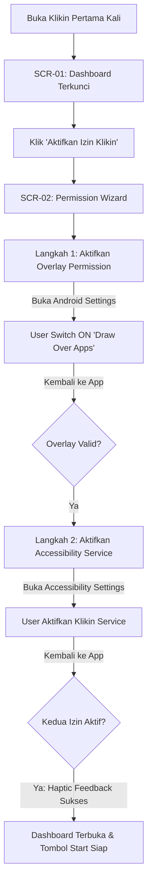
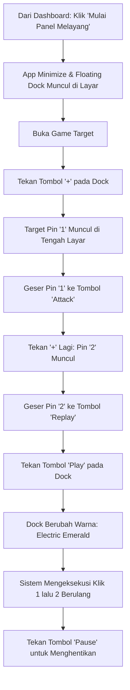

# Design Brief — Klikin (Android Automation Utility)

* **Produk:** Klikin (Auto-Clicker & Screen Automation)
* **Target OS:** Android 7.0+ (API 24+)
* **Role:** Lead / Senior Product Designer
* **Status:** Final Architectural Specification (Ready for Implementation)

---

## 1. Design Principles (3 Aturan Wajib)

Setiap keputusan UI, layout, dan interaksi dalam Klikin harus patuh tanpa kompromi pada 3 pilar ini:

### 1. Zero Obstruction, Maximum Contrast
> *Floating controller dan pointer tidak boleh menutupi elemen penting aplikasi target, namun harus selalu terbaca di atas latar belakang apa pun.*
* **Aturan:** Panel melayang menggunakan surface semi-transparan (*Smoked Glass* 90% opacity dengan 1px border kontras tinggi). Pointer target wajib memiliki *dual-ring border* (putih di dalam, hitam di luar) agar tidak pernah hilang/invisible, baik saat berada di atas latar game berwarna putih terang, hitam legam, maupun warna-warni padat.

### 2. Tactile & Glanceable State Machine
> *Status sistem (Idle, Armed, Running, Paused) harus dapat diverifikasi pengguna dalam waktu < 200 ms hanya dari peripheral vision.*
* **Aturan:** Tidak boleh ada status yang hanya mengandalkan teks kecil. Setiap pergantian state wajib mengubah warna aksen utama secara global (*Electric Emerald* saat running, *Vibrant Amber* saat paused, *Crimson Alert* saat error/service mati) dan disertai haptic feedback terkalibrasi (*tick* saat target digeser, *heavy click* saat start/stop).

### 3. Forgiving & Non-Overlapping Hit Geometry
> *Di atas game atau aplikasi yang bergerak cepat, mis-click pada panel kendali adalah bencana fatal bagi pengguna.*
* **Aturan:** Seluruh tombol pada floating dock memiliki dimensi fisik interaktif minimal $48 \times 48\text{ dp}$ (sesuai standar WCAG & Android Material), dengan jarak antar-tombol minimal $8\text{ dp}$. Area drag panel dipisahkan secara fisik dari area tombol aksi untuk mencegah ketidaksengajaan memicu klik saat berniat menggeser panel.

---

## 2. Visual Direction

### Mood & Karakter
* **Industrial Precision Tool / Tactical Utility:** Mengambil estetika instrumen audio hardware (DAW, synthesizer analog, multimeter digital) yang dipadukan dengan modern dark developer tools. Ringkas, tegas, fungsional, tanpa ornamen kosmetik berlebih.
* **Bukan "Gamer RGB Tacky":** Menghindari gradien pelangi mencolok, sudut tajam berlebihan, atau gaya neon sci-fi 2010 yang murahan.
* **Bukan "Generic Material 3":** Menghindari tema standar Android ungu/pastel yang lembut dan memakan banyak ruang (whitespace boros). Klikin adalah alat presisi tinggi yang membutuhkan kerapatan informasi (information density) yang efisien.

### Referensi Visual & Benchmarks
* **Ableton Live / Teenage Engineering:** Kerapatan fungsional, tipografi monospaced untuk angka, dan tactile feedback visual.
* **Raycast / Linear:** Desain dark mode modern berbasis kontras netral slate, subtle border $1\text{ px}$, dan aksen warna vibran fungsional.
* **Android Studio Profiler:** Kontrol panel ringkas, floating mini-toolbar yang presisi.

---

## 3. Design Tokens

### 3.1 Palet Warna (The Precision Dark Theme)

Aplikasi utama dan floating overlay menggunakan basis tema gelap murni untuk menghemat konsumsi daya baterai layar OLED saat bermain game dan mengurangi kelelahan mata pengguna di malam hari.

```
Base Background (Obsidian)  : #0B0E14  (Host App canvas)
Surface Raised (Slate)      : #151922  (Cards, modals, sheet)
Surface Floating (Glass)    : #1C2230  (Native WindowManager Dock, 92% opacity)
Border / Stroke Subtle      : #2A3245  (1px separator & container borders)
Border / Stroke Focused     : #3D4863  (Interactive state hover/press)

Brand / Run (Electric Emerald): #00E599 (Running state, primary CTAs, active badges)
Pause / Warning (Safety Amber): #FFB020 (Paused state, unsaved changes, attention)
Destructive (Crimson Alert)   : #FF4757 (Stop service, delete profile, error state)
Target Badge Neutral (Cyber)  : #00C2FF (Target pointers 1, 2, 3... default)
Target Badge Active (Focus)   : #FFD600 (Currently selected/edited target)

Text Primary   : #FFFFFF (Titles, numbers, active icons)
Text Secondary : #94A3B8 (Labels, captions, descriptions)
Text Tertiary  : #64748B (Disabled states, placeholder)
```

#### Alasan Pemilihan Warna:
* `#00E599 (Electric Emerald)` dipilih menggantikan hijau standar karena memiliki luminansi tinggi yang langsung memotong kegelapan latar dan secara universal menandakan "sistem bekerja aman".
* `#00C2FF (Cyan)` dan `#FFD600 (Yellow)` untuk target pin: Merupakan dua warna dengan spektrum visibilitas tertinggi terhadap layar game (kontras terhadap elemen 3D, rumput, langit, atau UI gelap game).

---

### 3.2 Skala Tipografi

* **Primary Font (UI & Label):** `Plus Jakarta Sans` — Modern, geometric grotesque, sangat mudah dibaca pada ukuran kecil (micro-copy).
* **Numerical & Data Font (Timer, Koordinat, Counter):** `JetBrains Mono` — Monospaced font dengan *tabular figures*. Menghilangkan efek "wobble" (layout bergeser-geser) saat millisecond timer berjalan cepat.

| Token | Family | Weight | Size (sp) | Line Height | Tracking | Penggunaan |
| :--- | :--- | :--- | :--- | :--- | :--- | :--- |
| `display-lg` | Plus Jakarta Sans | 800 (Bold) | 28 | 34 | -0.02em | Hero header, title onboarding |
| `title-md` | Plus Jakarta Sans | 700 (Bold) | 18 | 24 | -0.01em | Section title, modal header |
| `body-md` | Plus Jakarta Sans | 500 (Medium) | 14 | 20 | 0 | Deskripsi, body text card |
| `label-sm` | Plus Jakarta Sans | 600 (SemiBold)| 11 | 14 | +0.02em | Micro-badges, uppercase captions |
| `data-lg` | JetBrains Mono | 700 (Bold) | 22 | 26 | 0 | Counter ketukan, delay besar |
| `data-sm` | JetBrains Mono | 600 (SemiBold)| 13 | 16 | 0 | Koordinat X/Y, millisecond stepper |

---

### 3.3 Skala Spacing & Layout Grid (4px Base)

* `space-1` : $4\text{ dp}$ (Pemisah micro-icon ke text, padding badge)
* `space-2` : $8\text{ dp}$ (Jarak antar tombol pada floating dock)
* `space-3` : $12\text{ dp}$ (Padding internal input field, list gap)
* `space-4` : $16\text{ dp}$ (Default padding container card dan screen gutter)
* `space-6` : $24\text{ dp}$ (Jarak antar grup section di dashboard)
* `space-8` : $32\text{ dp}$ (Margin hero action bottom sheet)

---

### 3.4 Corner Radius & Shadow Tokens

* `radius-sm` : $6\text{ dp}$ (Tag, chip indicator, input stepper)
* `radius-md` : $12\text{ dp}$ (Kartu profil, permission card)
* `radius-lg` : $20\text{ dp}$ (Action sheets, modal dialog)
* `radius-pill`: $999\text{ dp}$ (Floating control bar, Target pin badges, Primary CTAs)

#### Shadows (Khusus Native WindowManager Overlay):
* `shadow-dock` : `0dp 12dp 32dp rgba(0, 0, 0, 0.65), 0dp 0dp 0dp 1dp rgba(255, 255, 255, 0.08)` (Memberikan pemisahan visual mutlak dari konten game di bawahnya).
* `shadow-pin` : `0dp 4dp 16dp rgba(0, 0, 0, 0.75), 0dp 0dp 0dp 2dp #000000` (Outer stroke hitam pekat menjamin pointer terbaca jelas di background putih).

---

## 4. Screen Inventory

```
[KLIKIN APPLICATION ECOSYSTEM]
├── Flutter Host App
│   ├── SCR-01: Dashboard / Home Hub
│   ├── SCR-02: Permission Setup Wizard (Modal Sheet)
│   ├── SCR-03: Profile Preset Manager
│   └── SCR-04: Preset Detail & Target List Editor
│
└── Native Android Floating Layer (WindowManager)
    ├── VIEW-01: Floating Control Dock (Expanded Bar)
    ├── VIEW-02: Floating Control Dock (Minimized Bubble)
    ├── VIEW-03: Floating Target Pin (Draggable 1..N)
    └── VIEW-04: Quick Interval Setting Dialog (Modal Mini)
```

| Screen ID | Nama Layar | Konteks Render | Tujuan Utama |
| :--- | :--- | :--- | :--- |
| **SCR-01** | Dashboard Hub | Flutter Activity | Memeriksa status izin, memilih mode (Single vs Multi), me-load profil cepat, dan tombol "Start Overlay Service". |
| **SCR-02** | Permission Wizard | Flutter Modal | Memandu aktivasi izin Accessibility & Draw Over Apps dengan visual checklist dan auto-recheck. |
| **SCR-03** | Profile Preset Hub | Flutter Screen | Mengelola daftar 5 profil tersimpan (Create, Edit, Delete, Activate). |
| **SCR-04** | Profile Configuration | Flutter Screen | Form detail: Atur nama profil, loop mode (Infinite vs Finite), default delay, dan reorder list koordinat. |
| **VIEW-01** | Floating Control Dock | Kotlin WindowManager | Controller melayang vertikal/horizontal saat bermain game (Play, Pause, Add Target, Remove, Settings, Close). |
| **VIEW-02** | Minimized Dock Bubble | Kotlin WindowManager | State ciut (collapsed) dari dock menjadi 1 icon pill kecil di tepi layar agar tidak mengganggu gameplay. |
| **VIEW-03** | Floating Target Pointer | Kotlin WindowManager | Pin melayang berdiameter $40\text{ dp}$ dengan angka urut yang diletakkan pengguna di atas tombol target. |
| **VIEW-04** | Quick Config Overlay | Kotlin WindowManager | Dialog pop-up ringan untuk mengubah interval millisecond tanpa harus kembali ke aplikasi Flutter. |

---

## 5. User Flows

### Flow 1: First-Time User Onboarding & Permission Granting


### Flow 2: Setting Multi-Point & Menjalankan Auto-Clicker di Atas Game


### Flow 3: Menyimpan Sesi Menjadi Profil Preset
```mermaid
flowchart TD
    A[Selesai Mengatur Posisi Pin 1, 2, 3 di Layar] --> B[Tekan Ikon 'Gear' di Floating Dock]
    B --> C[Muncul Menu Cepat: Pilih 'Simpan Profil']
    C --> D[Input Dialog Singkat: 'Farming Event X']
    D --> E[Simpan ke Local DB via SharedPreferences/Hive]
    E --> F[Toast Konfirmasi: 'Profil Tersimpan (Slot 2/5)']
```

---

## 6. Layout per Screen

### SCR-01: Dashboard Hub (Flutter)
```
+-------------------------------------------------------------+
| [=] Klikin                          [Storage: 2/5 Profil]   |
+-------------------------------------------------------------+
| [PERINGATAN IZIN SISTEM] (Hanya muncul jika izin mati)       |
| (!) 2 Izin Diperlukan untuk Menjalankan Klikin              |
| [ Setup Sekarang -> ]                                       |
+-------------------------------------------------------------+
| MODE OPERASI                                                |
| +-------------------------+     +-------------------------+ |
| | (o) SINGLE POINT        |     | ( ) MULTI POINT         | |
| | 1 Titik Target Berulang |     | Rangkaian Titik 1, 2, 3 | |
| +-------------------------+     +-------------------------+ |
+-------------------------------------------------------------+
| PROFIL AKTIF                                                |
| +---------------------------------------------------------+ |
| | [Icon] Farming Dungeon Lv. 4                            | |
| | 3 Target Points • Loop: Tak Terbatas • Delay: 350ms     | |
| | [Ganti Profil]                         [Edit Parameter] | |
| +---------------------------------------------------------+ |
+-------------------------------------------------------------+
| PENGATURAN CEPAT                                            |
| Jeda Default Antar Klik: [ - ]  350 ms  [ + ]               |
| Durasi Tekan (Touch Down): [ - ]   50 ms  [ + ]             |
+-------------------------------------------------------------+
|                                                             |
|   [================= MULAI PANEL MELAYANG ================]  |
|                                                             |
+-------------------------------------------------------------+
```
* **Hierarki:** Primary CTA ditempatkan di *sticky bottom zone* berukuran penuh ($56\text{ dp}$ height, Electric Emerald). Status izin ditempatkan paling atas (*top banner*) jika belum lengkap.

---

### VIEW-01 & VIEW-03: Floating Overlay Architecture (Native Kotlin)
Struktur visual ketika melayang di atas game:

```
[Screen Layar Game Pihak Ketiga]

             ( 1 )  <-- [VIEW-03: Target Pin 1] (Cyan circle, 40dp)
                     Posisi: X=320, Y=1450

                                ( 2 )  <-- [VIEW-03: Target Pin 2]
                                         Posisi: X=880, Y=1450

+-----------------------+ <-- [VIEW-01: Floating Dock] (Vertical Pill Dock)
| [ :::: ] Drag Handle  |     Dimensi: 52dp lebar x 240dp tinggi
|-----------------------|     Background: #1C2230, Alpha 92%, Radius 999dp
|  ( > )   Play / Pause |     Border: 1px solid #3D4863
|-----------------------|
|  ( + )   Tambah Pin   |
|-----------------------|
|  ( - )   Kurang Pin   |
|-----------------------|
|  ( * )   Quick Config |
|-----------------------|
|  ( < )   Minimize     |
|-----------------------|
|  ( X )   Tutup Total  |
+-----------------------+
```

* **Interaksi Dock:**
  * Tombol `Play` berubah menjadi ikon `Pause` dan warnanya berubah menjadi Emerald (`#00E599`).
  * Saat `Minimize` ditekan, dock menyusut menjadi bulatan kecil sebesar $36\times36\text{ dp}$ di pinggir layar dengan chevron panah untuk membuka kembali.
* **Interaksi Target Pin:**
  * Diameter $40\times40\text{ dp}$. Angka di tengah dengan font `JetBrains Mono` bold $16\text{ sp}$.
  * Memiliki jarum bidik titik tengah (crosshair dot $4\text{ dp}$) agar penempatan koordinat tepat di tengah tombol game.

---

## 7. Component Library

### C-01: Primary Action Button (Pill Button)
* **Deskripsi:** Tombol aksi utama host app (Mulai Service, Simpan Profil).
* **Ukuran:** Tinggi $52\text{ dp}$, Radius $999\text{ dp}$ (Pill), Lebar Full Container.
* **Variants & States:**
  * *Default:* Background `#00E599`, Text `#0B0E14` (Bold 16sp).
  * *Pressed:* Scale $0.98$, Background `#00C782`.
  * *Disabled:* Background `#1C2230`, Text `#64748B`, Border `1px solid #2A3245`.

### C-02: Floating Dock Button (Native Android XML)
* **Deskripsi:** Icon button serbaguna di dalam floating overlay.
* **Ukuran:** Hitbox $48\times48\text{ dp}$, Visual Icon $24\times24\text{ dp}$.
* **Variants:**
  * *Action Play:* Background lingkaran aksen `#00E599`, Icon Hitam.
  * *Action Pause:* Background lingkaran aksen `#FFB020`, Icon Hitam.
  * *Secondary Utility (+, -, Gear, Minimize):* Background transparan, Icon `#94A3B8`. State pressed: Background `#2A3245` alpha 50%.
  * *Close:* Icon `#FF4757`.

### C-03: Numbered Target Pin (Target Pointer Badge)
* **Deskripsi:** Marker melayang untuk menentukan posisi klik $X, Y$.
* **Struktur Layer:**
  1. Outer Circle: Diameter $40\text{ dp}$, Background `#00C2FF` (Cyan), Border `2px solid #000000`.
  2. Center Indicator: Center crosshair point $2\text{ dp}$ hitam.
  3. Text Label: Angka urutan (1, 2, 3..), `JetBrains Mono` Bold $15\text{ sp}$, Text `#000000`.
* **States:**
  * *Idle / Ready:* Warna dasar Cyan (`#00C2FF`).
  * *Active / Dragged:* Scaled $1.15\times$, Bayangan tebal, Ring luar berubah menjadi Yellow (`#FFD600`).
  * *Executing (Clicked):* Ripple animation keluar berdurasi $150\text{ ms}$ sebagai feedback visual saat ketukan terjadi.

### C-04: Numeric Millisecond Stepper
* **Deskripsi:** Pengontrol angka presisi untuk interval dan durasi tekan.
* **Komponen:**
  * Tombol Minus `[ - ]` ($40\times40\text{ dp}$).
  * Display Value di tengah: `350 ms` (Font `JetBrains Mono` $18\text{ sp}$ warna `#FFFFFF`).
  * Tombol Plus `[ + ]` ($40\times40\text{ dp}$).
  * Quick-select chips di bawahnya: `[50ms]` `[100ms]` `[250ms]` `[500ms]` `[1s]`.

---

## 8. State Matrix

| Screen / Komponen | Empty State | Loading / Running State | Error / Failure State | Success State |
| :--- | :--- | :--- | :--- | :--- |
| **SCR-01: Dashboard** | "Belum ada profil tersimpan. Buat profil pertama Anda." Tombol CTA: *Buat Profil Baru*. | Tombol "Mulai Panel" menampilkan spinner mini saat Service Native sedang mengikat (binding) process. | Banner merah: "Accessibility Service Terputus oleh Sistem. Ketuk untuk mengaktifkan kembali." | Badge Hijau: "Sistem Siap. Kedua Izin Aktif." |
| **SCR-03: Profile List** | Ilustrasi blueprint kosong: "Slot profil kosong (0/5)." | Skeleton loading placeholder saat membaca database lokal SharedPreferences/Hive. | Alert toast: "Gagal menyimpan. Slot profil telah mencapai batas maksimal (5/5)." | Card profil aktif tersorot dengan border hijau `1px solid #00E599`. |
| **VIEW-01: Floating Dock** | Saat belum ada target ditambahkan: Tombol Play disabled (opacity 40%). | Tombol Play berubah jadi Pause (Kuning/Hijau berkedip pelan). Status counter running. | Jika eksekusi terhambat OS: Tombol serentak border merah berkedip 2x. | Animasi subtle glow hijau di sekeliling dock saat klik sukses dieksekusi. |
| **Konektivitas / Offline** | *Aplikasi 100% Offline-First.* Tidak memerlukan koneksi internet sama sekali; tidak ada layar error jaringan. |

---

## 9. Responsive & Multi-Orientation Behaviour

### 1. Rotasi Layar (Portrait $\leftrightarrow$ Landscape)
Ini adalah use case paling krusial karena mobile gamer sering bermain dalam mode landscape.
* **Floating Dock:**
  * Pada mode **Portrait**: Dock otomatis menyusun tombol secara **vertikal** di sisi kanan layar.
  * Pada mode **Landscape**: Dock otomatis beralih menjadi susunan **horizontal** atau tetap vertikal ramping di sisi bezel terluar agar tidak memotong rasio aspek game 16:9 / 20:9.
* **Target Pin Clamping:**
  * Saat rotasi berubah, native service mendeteksi perubahan dimensi via `WindowManager.getDefaultDisplay()`.
  * Jika koordinat target $X, Y$ sebelumnya berada di luar resolusi baru, sistem melakukan **Coordinate Clamping**: Pin otomatis digeser ke batas layar terdalam ($16\text{ dp}$ dari tepi layar) agar pin tidak hilang dari pandangan pengguna.

### 2. Tablet & Layar Lipat (Foldable Devices)
* Layout Flutter Host App menggunakan limit `maxContentWidth: 600dp` terpusat di tengah layar (*centered column*) untuk mencegah form input tertarik terlalu lebar di layar tablet Android (seperti Xiaomi Pad atau Samsung Galaxy Tab).
* Ukuran Floating Dock Native tetap konstan dalam satuan **dp** (Density-independent Pixels) agar dimensi fisik jari tetap nyaman dan tidak membesar secara proporsional.

---

## 10. Accessibility & Compliance

### 1. Rasio Kontras Warna (WCAG 2.1 AA Compliance)
* Seluruh teks utama `#FFFFFF` di atas surface `#0B0E14` dan `#151922` memiliki rasio kontras **> 14:1** (jauh melampaui batas minimal 4.5:1).
* Teks status `#00E599` di atas background gelap memiliki rasio kontras **11.2:1**.
* Label angka Target Pin (Teks `#000000` di atas bulatan `#00C2FF`) memiliki rasio kontras **9.4:1**.

### 2. Target Sentuh Minimum (Touch Targets)
* Tidak ada komponen interaktif pada Flutter App maupun Floating Native Overlay yang memiliki area sentuh lebih kecil dari **$48 \times 48\text{ dp}$**. Untuk ikon berukuran $20\text{ dp}$, padding transparan diperluas hingga mencapai bounding box $48\text{ dp}$.

### 3. Screen Reader (Android TalkBack) & Semantics
Meskipun auto-clicker sering digunakan secara visual, aplikasi host Flutter wajib mendukung TalkBack penuh:
* Tombol Play/Pause memiliki `Semantics.label`: *"Mulai eksekusi ketukan otomatis"* dan *"Jeda eksekusi ketukan"*.
* Target Pin memiliki content description: *"Titik target nomor [index], koordinat X [x], Y [y]. Ketuk dua kali dan tahan untuk menggeser."*
* Indikator status izin memiliki `Semantics.liveRegion` untuk mengumumkan perubahan status izin secara otomatis saat pengguna kembali dari halaman Pengaturan Android.

### 4. Haptic Feedback Signature
Klikin tidak hanya mengandalkan mata:
* **Haptic Tap Pendek (Light Click):** Diberikan saat menekan tombol `+`, `-`, atau menggeser posisi pin.
* **Haptic Tegas (Heavy Confirmation):** Diberikan saat tombol `Play` atau `Stop` ditekan.
* **Haptic Peringatan (Double Pulse):** Diberikan jika pengguna mencoba menjalankan klik tetapi belum ada titik target yang diletakkan.
