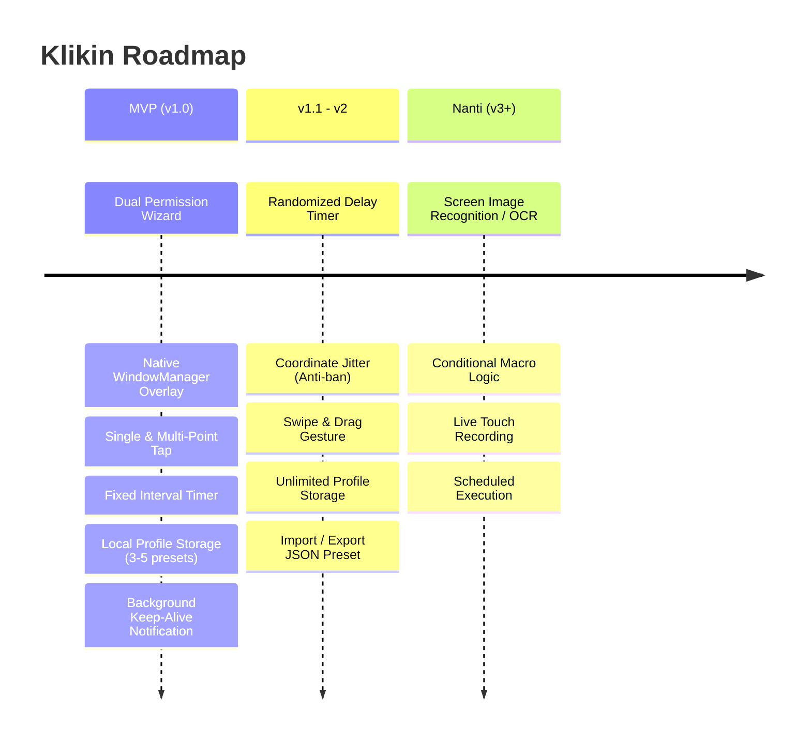

# Product Requirements Document (PRD) — Klikin

* **Nama Produk:** Klikin
* **Platform:** Android Only (Android 7.0+ / API Level 24+)
* **Tech Stack:** Flutter (Frontend & Profile Management) + Kotlin Native (`AccessibilityService`, `WindowManager` Native View)
* **Dokumen Versi:** 1.0.0 (MVP Specification)
* **Status:** Ready for Engineering / Vibe Coding

---

## 1. Problem Statement

### Siapa yang dirugikan?
1. **Mobile Gamers (Khususnya genre RPG, Gacha, Idle, dan Farming):** Terjebak dalam grinding berulang (klaim hadiah, loop stage level, skip dialog) yang memakan waktu berjam-jam.
2. **QA/Software Automation Testers:** Membutuhkan simulasi ketukan berulang secara manual untuk stress-test stabilitas aplikasi dan performa UI.
3. **Pekerja Operasional / Entry Data Lapangan:** Sering melakukan tap rutin (seperti auto-refresh data antrean, absensi berbasis lokasi, atau sinkronisasi data internal perusahaan) di antarmuka mobile.

### Mengapa ini masalah nyata?
* **Physical Strain:** Gerakan mengetuk layar secara berulang memicu Repetitive Strain Injury (RSI) dan kelelahan otot jari.
* **Human Inconsistency:** Ritme dan posisi ketukan manual manusia tidak konstan (mudah meleset atau jeda tidak seragam).
* **Hardware Degradation:** Tekanan jari berulang di titik yang sama secara ekstrem dapat merusak lapisan oleophobic layar ponsel.
* **OS Limitations:** Sistem operasi Android standar tidak menyediakan fitur bawaan macro-clicker non-root yang aman dan mudah dioperasikan.

---

## 2. Target User & Persona

### Target Demografis
* Pengguna Android aktif dengan perangkat Android 7.0 ke atas.
* Rentang usia 18–40 tahun yang sering berinteraksi dengan tugas repetitif di smartphone.

---

### Persona 1: Hardcore Mobile Gamer
* **Nama:** Arya (23 tahun)
* **Pekerjaan:** Mahasiswa & Semi-casual Gamer
* **Perilaku:** Memainkan game Turn-Based RPG / Idle Game di sela waktu luang.
* **Pain Point:** Harus menekan tombol "Replay", "Start Mission", dan "Claim" setiap 2 menit sekali selama 4 jam setiap malam. Arya frustrasi karena tidak bisa meninggalkan ponselnya untuk belajar atau istirahat.
* **Kebutuhan:** Klikin yang dapat mengeksekusi 3 titik urut secara bergantian di atas game tanpa membuat game lag atau force close.

---

### Persona 2: Mobile QA Tester / Staff Lapangan
* **Nama:** Budi (29 tahun)
* **Pekerjaan:** Junior Mobile QA & Operations Support
* **Perilaku:** Menguji ketahanan tombol *submit* aplikasi kurir internal dan melakukan auto-refresh pada dashboard antrean order.
* **Pain Point:** Mengetuk tombol berkali-kali untuk menguji idempotency atau refresh data antrean sangat membosankan dan rentan salah hitung.
* **Kebutuhan:** Auto-clicker dengan fixed interval yang presisi (misal: tepat tiap 500ms), bisa diset batas 10.000 ketukan, dan pengaturannya tersimpan ke profil kerja sehingga tidak perlu setting ulang setiap hari.

---

## 3. Goals & Non-Goals

### Goals (Scope MVP)
* **Zero Root Dependency:** Berjalan 100% tanpa root menggunakan `AccessibilityService.dispatchGesture` resmi Android API 24+.
* **Ultra-lightweight Floating Controller:** Menggunakan Native Android View (XML + WindowManager) dengan footprint RAM total < 60 MB saat overlay aktif di atas aplikasi lain.
* **Dual Execution Modes:** Mendukung Single-Point Click dan Multi-Point Sequential Click (titik 1, 2, 3 dst).
* **Deterministic Timing:** Menjamin interval fixed timer stabil dengan deviasi jeda maksimal $\le 10\text{ ms}$.
* **Local Profile Persistence:** Menyimpan minimal 3–5 profil konfigurasi (titik koordinat & timing) di database/storage lokal perangkat.
* **Stress Resilience:** Sanggup mengeksekusi minimal 10.000 ketukan berturut-turut tanpa Application Not Responding (ANR) atau service termination.

### Non-Goals (Bukan Bagian dari MVP)
* **Tidak Ada Fitur Swipe / Drag / Gesture Cubit:** Hanya fokus pada *Tap/Click*. Fitur swipe dialokasikan untuk v2.
* **Tidak Ada Image Recognition / OCR Triggers:** Tidak ada deteksi otomatis elemen layar berbasis gambar (hanya koordinat spasial $X, Y$).
* **Tidak Ada Anti-Ban / Coordinate Jitter / Randomized Delay di MVP:** Delay bersifat fixed; fitur variasi interval dan jitter acak dijadwalkan pada v1.1/v2.
* **Tidak Ada Cloud Sync / Login Akun:** Klikin berjalan 100% offline-first tanpa registrasi akun.
* **Tidak Mendukung iOS / Android < 7.0:** Tidak ada backward compatibility untuk API < 24 karena batasan native API `dispatchGesture`.

---

## 4. User Stories

| ID | Format Story | Acceptance Criteria |
| :--- | :--- | :--- |
| **US-01** | **Sebagai** pengguna baru, **saya ingin** dipandu mengaktifkan izin Aksesibilitas dan Overlay melalui alur yang jelas, **supaya** aplikasi dapat langsung berfungsi tanpa kebingungan teknis. | Muncul indikator visual status izin (Merah: Mati, Hijau: Aktif). Tombol memandu langsung ke halaman Settings OS terkait. |
| **US-02** | **Sebagai** gamer, **saya ingin** menempatkan 1 titik target di atas tombol game dan mengatur interval ketukan, **supaya** tombol tersebut dapat ditekan berulang tanpa intervensi tangan saya. | Target point berupa pin melayang draggable. Koordinat $X, Y$ terbaca akurat. Klik berjalan saat tombol Play ditekan. |
| **US-03** | **Sebagai** QA tester, **saya ingin** menambah beberapa titik target (1, 2, 3) yang dieksekusi berurutan, **supaya** alur multi-step pada aplikasi saya dapat diuji secara otomatis. | Pengguna dapat menambah/menghapus titik dengan tombol `+` dan `-` pada floating controller. Titik memiliki penomoran urut visual. |
| **US-04** | **Sebagai** pengguna, **saya ingin** mengontrol play, pause, minimize, dan tutup langsung dari floating panel di atas aplikasi lain, **supaya** saya tidak perlu bolak-balik membuka aplikasi utama Klikin. | Floating panel dapat digeser (drag) ke tepi layar, di-collapse (minimize) menjadi ikon kecil, dan ditutup kapan saja. |
| **US-05** | **Sebagai** pekerja rutin, **saya ingin** menyimpan konfigurasi koordinat dan interval ke dalam profil bernama, **supaya** saya tidak perlu memetakan ulang koordinat setiap sesi baru. | Profil tersimpan di local storage (Hive/SharedPreferences). Pengguna dapat me-load konfigurasi tersimpan dalam < 2 detik. |

---

## 5. Fitur: MVP vs v2 vs Nanti



### Breakdown Fitur
* **MVP (v1.0):**
  1. Permission Health Check & Auto-router (`SYSTEM_ALERT_WINDOW` & `BIND_ACCESSIBILITY_SERVICE`).
  2. Native Android View Floating Controller (Kotlin + XML).
  3. Single-Point Auto Clicker.
  4. Multi-Point Sequential Auto Clicker (Titik 1, 2, 3..).
  5. Konfigurasi Timer (Delay interval dalam ms/detik, durasi tekan / touch down duration, loop counter).
  6. Floating Target Pointer Widget (Draggable pin dengan visual indicator).
  7. Penyimpanan Profil Lokal (CRUD 5 Profil Preset).
  8. Foreground Notification Service (mencegah low memory killer).
* **v1.1 / v2:**
  1. Randomized Interval (contoh: $500\text{ ms} \pm 50\text{ ms}$).
  2. Coordinate Jitter Radius (contoh: radius $5\text{ px}$ acak di sekitar target).
  3. Swipe / Drag Trajectory ($X_1, Y_1 \to X_2, Y_2$).
  4. Import/Export Config file (.json).
  5. Compact Bubble Mode.
* **Nanti (v3+ / Backlog):**
  1. Visual Automation (Image Matching/OCR via OpenCV/ML Kit).
  2. Input Recorder (merekam sentuhan jari langsung dan me-replay).

---

## 6. Functional Requirements (Detail per Fitur MVP)

### FR-01: Permission Onboarding Engine
* **FR-01.1:** Sistem harus memeriksa dua izin wajib saat Flutter UI dibuka:
  1. `android.permission.SYSTEM_ALERT_WINDOW` (Draw over other apps).
  2. `android.permission.BIND_ACCESSIBILITY_SERVICE` (Klikin Accessibility Service).
* **FR-01.2:** Jika izin belum diberikan, UI menampilkan badge status berwarna merah ("Nonaktif") dan tombol direct intent:
  * Intent 1: `Settings.ACTION_MANAGE_OVERLAY_PERMISSION`
  * Intent 2: `Settings.ACTION_ACCESSIBILITY_SETTINGS`
* **FR-01.3:** Saat kedua izin aktif, status berubah hijau ("Aktif") dan tombol "Mulai Service" dapat ditekan.

---

### FR-02: Native Floating Control Panel (Kotlin WindowManager)
* **FR-02.1:** Panel kontrol melayang dibangun menggunakan layout XML Native Android via `WindowManager` dengan type flag `TYPE_APPLICATION_OVERLAY`.
* **FR-02.2:** Elemen interaktif pada panel kontrol:
  * Tombol **Play / Pause** (Toggle eksekusi klik).
  * Tombol **Add Target (+)** (Menambah pointer nomor baru ke layar).
  * Tombol **Remove Target (-)** (Menghapus pointer nomor terakhir).
  * Tombol **Settings / Minimize** (Meringkas panel ke tepi layar atau membuka sheet konfigurasi).
  * Tombol **Close (X)** (Menutup overlay dan menghentikan background service).
* **FR-02.3:** Panel kontrol dapat di-drag ke seluruh area layar dengan event `MotionEvent.ACTION_MOVE` tanpa memicu event klik yang tidak disengaja.

---

### FR-03: Visual Target Pointer (Floating Pin)
* **FR-03.1:** Setiap target direpresentasikan sebagai View melayang sirkular dengan label nomor urut di tengah (misal: "1", "2").
* **FR-03.2:** Pointer dapat diposisikan bebas oleh pengguna dengan cara di-drag. Koordinat titik tengah sirkular ($X, Y$) disimpan secara real-time.
* **FR-03.3:** Flag window pointer harus mendukung `FLAG_NOT_FOCUSABLE`. Saat klik otomatis berjalan, pointer harus `FLAG_NOT_TOUCHABLE` agar sentuhan yang di-dispatch tembus ke aplikasi di bawahnya (touch passthrough).

---

### FR-04: Gesture Execution Engine (`AccessibilityService`)
* **FR-04.1:** Eksekusi klik dilakukan melalui API `AccessibilityService.dispatchGesture`.
* **FR-04.2:** Path gestur dibangun menggunakan `Path()` dengan koordinat titik target ($X, Y$).
* **FR-04.3:** Parameter eksekusi per titik:
  * `pressDuration`: Durasi penekanan layar (default: $50\text{ ms}$).
  * `delayBeforeNext`: Jeda waktu sebelum eksekusi titik berikutnya (default: $500\text{ ms}$, batas minimal yang diizinkan $25\text{ ms}$).
* **FR-04.4:** Mode Loop:
  * *Infinite:* Berjalan terus hingga tombol Pause ditekan.
  * *Count-based:* Berhenti otomatis setelah mencapai $N$ siklus loop.
* **FR-04.5:** Handler eksekusi menggunakan coroutine background (`Dispatchers.Default`) untuk memastikan UI thread tidak pernah terblokir (anti-ANR).

---

### FR-05: Bridge Komunikasi (Flutter <-> Kotlin Native)
* **FR-05.1:** Komunikasi antara antarmuka Flutter dan Service Android menggunakan `MethodChannel` (`com.klikin.app/controller`) dan `EventChannel` untuk streaming status.
* **FR-05.2:** Method wajib:
  * `startOverlayService(profileData)` $\to$ Membuka WindowManager.
  * `stopOverlayService()` $\to$ Menutup WindowManager.
  * `checkPermissions()` $\to$ Mengembalikan status boolean kedua izin.
  * `onServiceStateChanged` $\to$ Notifikasi ke Flutter jika service dimatikan dari luar oleh sistem.

---

### FR-06: Profile Management (Local Storage)
* **FR-06.1:** Aplikasi Flutter menyediakan antarmuka penyimpanan profil (Maksimal 5 profil untuk MVP).
* **FR-06.2:** Profil mencakup: Nama Profil, Tipe Mode (Single/Multi), Daftar Titik Koordinat, Nilai Delay, dan Pengaturan Loop.
* **FR-06.3:** Data disimpan menggunakan engine persisten lokal (Hive atau SharedPreferences berformat JSON terenkripsi/aman).
* **FR-06.4:** Fitur "Load Profile" langsung memuat seluruh titik target ke overlay sesuai koordinat tersimpan.

---

### FR-07: Foreground Lifecycle & Safeguard
* **FR-07.1:** Service Android berjalan sebagai Foreground Service dengan Persistent Notification wajib (`START_STICKY`) bertuliskan "Klikin sedang aktif di latar belakang".
* **FR-07.2:** Tombol darurat "STOP" tersedia langsung pada Notification tray Android.
* **FR-07.3:** Emergency Stop: Jika layar mati (`ACTION_SCREEN_OFF`) atau terdapat panggilan telepon masuk, eksekusi klik otomatis wajib langsung di-pause untuk keamanan.

---

## 7. Sketsa Data Model

```
+-----------------------------------------------------------+
|                       ClickProfile                        |
+-----------------------------------------------------------+
| - id: String (UUID)                                       |
| - name: String (Max 30 char)                              |
| - mode: ProfileMode [SINGLE_POINT | MULTI_POINT]           |
| - loopConfig: LoopConfig                                  |
| - targets: List<TargetPoint>                              |
| - createdAt: DateTime                                     |
| - updatedAt: DateTime                                     |
+-----------------------------------------------------------+
                             |
                             | 1..*
                             v
+-----------------------------------------------------------+
|                       TargetPoint                         |
+-----------------------------------------------------------+
| - index: Int (1-based order)                              |
| - x: Int (Absolute screen pixel X)                        |
| - y: Int (Absolute screen pixel Y)                        |
| - pressDurationMs: Long (default: 50 ms)                  |
| - delayAfterMs: Long (default: 500 ms, min: 25 ms)        |
+-----------------------------------------------------------+

+-----------------------------------------------------------+
|                        LoopConfig                         |
+-----------------------------------------------------------+
| - loopType: LoopType [INFINITE | FINITE_COUNT | TIMER]    |
| - maxCount: Int (default: 0, nullable)                    |
| - durationMinutes: Int (default: 0, nullable)             |
+-----------------------------------------------------------+
```

### JSON Representation Format
```json
{
  "id": "prf_8f93e1a0-52d1",
  "name": "Farming Level 4",
  "mode": "MULTI_POINT",
  "loopConfig": {
    "loopType": "FINITE_COUNT",
    "maxCount": 1000,
    "durationMinutes": null
  },
  "targets": [
    {
      "index": 1,
      "x": 540,
      "y": 1280,
      "pressDurationMs": 50,
      "delayAfterMs": 450
    },
    {
      "index": 2,
      "x": 820,
      "y": 1900,
      "pressDurationMs": 50,
      "delayAfterMs": 1000
    }
  ],
  "createdAt": "2026-09-27T22:00:00Z",
  "updatedAt": "2026-09-27T22:00:00Z"
}
```

---

## 8. Edge Case & Failure State

| Kondisi Edge Case | Risiko Sistem | Solusi Penanganan (Fail-safe) |
| :--- | :--- | :--- |
| **OEM Aggressive Battery Killer** (Xiaomi MIUI, Oppo ColorOS, Samsung OneUI). | `AccessibilityService` di-kill tiba-tiba di latar belakang saat aplikasi target berjalan berat. | Implementasi `NotificationManager` Foreground Service dengan channel prioritas tinggi (`IMPORTANCE_LOW` atau `IMPORTANCE_HIGH`) serta petunjuk panduan menonaktifkan Battery Optimization di app settings. |
| **Rotasi Layar (Portrait $\leftrightarrow$ Landscape)** | Koordinat $X, Y$ menjadi out-of-bounds (di luar jangkauan display) atau menekan target yang salah. | Listen event `OrientationEventListener` di Kotlin. Jika rotasi berubah, hentikan (pause) sementara loop dan posisikan target ke boundary terdekat (clamp coordinates) sambil menampilkan notifikasi toast peringatan. |
| **Layar Terkunci (Display Off / Lockscreen)** | Klik otomatis terus berjalan di atas lockscreen atau merusak input PIN/Password. | Daftarkan `BroadcastReceiver` untuk `Intent.ACTION_SCREEN_OFF`. Sistem wajib langsung menghentikan gestur secara otomatis. |
| **Panel Floating Tertutup / Tertimpa Dialog Pihak Ketiga** | Pengguna kehilangan kendali untuk menghentikan klik yang sedang berjalan liar. | **Failsafe Tombol Fisik:** Mendaftarkan listener pada Accessibility Service untuk memantau tombol **Volume Down**. Tekan tombol Volume Down langsung memaksa status menjadi `PAUSE`. |
| **Input Interval Terlalu Ekstrem (< 10 ms)** | Buffer `dispatchGesture` penuh (overflow), memicu spike CPU 100% dan ANR. | Hard clamping di level native Kotlin dan UI Flutter: Jeda minimum dibatasi ketat pada **25 ms**, dan durasi tekan minimum **20 ms**. |
| **Target Berada Tepat di Bawah Floating Controller** | Panel melayang terklik oleh gestur otomatisnya sendiri. | Posisi target pointer dipisahkan dari layer panel kontrol. Layer pointer diatur transparan terhadap sentuhan (`FLAG_NOT_TOUCHABLE`) selama fase eksekusi aktif. |

---

## 9. Success Metrics

### Engineering & Reliability Metrics (Definition of Done)
1. **Stress Test:** Berhasil mengeksekusi **10.000 ketukan berturut-turut** pada aplikasi pihak ketiga tanpa service crash, tanpa ANR, dan tanpa memory leakage.
2. **Resource Footprint:** Konsumsi RAM aplikasi di latar belakang saat overlay aktif berada **$< 60\text{ MB}$** (didukung oleh arsitektur Native WindowManager XML).
3. **CPU Overhead:** Konsumsi CPU rata-rata tambahan $\le 6\%$ pada kecepatan 120 ketukan per menit.
4. **Timing Accuracy:** Toleransi deviasi interval waktu ketukan $\le 10\text{ ms}$ pada spesifikasi fixed interval.
5. **Crash-Free Session Rate:** Ditargetkan $\ge 99.0\%$ pada perangkat uji berbasis Android 7.0 hingga Android 14+.

### User Experience Metrics
1. **Setup Velocity:** Pengguna lama (returning user) dapat me-load profil tersimpan dan memulai sesi dalam waktu **$< 15\text{ detik}$**.
2. **Onboarding Conversion:** $\ge 85\%$ pengguna baru berhasil mengaktifkan kedua izin (Accessibility + Overlay) pada percobaan pertama tanpa uninstalasi awal.

---

## 10. Open Questions (Pertanyaan Terbuka untuk Tim Eng)

1. **Volume Key Failsafe Hooking:** Apakah integrasi listener tombol fisik (Volume Down) di `AccessibilityService.onKeyEvent` memerlukan penambahan flag khusus di XML `accessibility_service_config.xml` (`android:canRequestFilterKeyEvents="true"`)? Apakah ada risiko benturan volume media saat pengguna bermain game?
2. **Resolusi Koordinat Saat Ganti Device:** Jika profil diekspor atau perangkat berganti resolusi (misal dari 1080p ke 720p), apakah koordinat harus dinormalisasi menjadi persentase float ($0.0 - 1.0$) sebelum disimpan, atau tetap piksel absolut di MVP? *(Rekomendasi saat ini: Tetap piksel absolut untuk MVP lokal).*
3. **Android 13+ (API 33) Restricted Settings:** Pada Android 13 ke atas, Google memblokir izin Accessibility untuk aplikasi yang di-sideload (APK manual) via mekanisme "Restricted Setting". Apakah kita perlu menyertakan modal panduan khusus ("Cara bypass restricted setting di Android 13/14") bagi pengguna instalasi APK non-PlayStore?
4. **Minimum Interval Clamping:** Apakah limit minimum $25\text{ ms}$ sudah cukup aman pada chipset low-end (seperti MediaTek Helio seri lama / Snapdragon 400 series) tanpa memicu throttle kernel?
