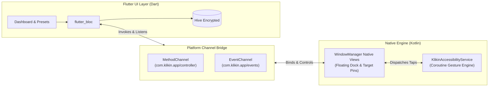

# Klikin (Android Auto-Clicker & Automation Engine)

> **Ultra-Lightweight, High-Precision Screen Automation for Android**

[-brightgreen.svg)](#)
[](#)
[](#)
[](#)
[](#)

Klikin adalah aplikasi otomasi pengetukan layar Android (*auto-clicker*) generasi baru yang dirancang khusus untuk gamer mobile, automation QA tester, dan pekerja operasional. Dibangun dengan kombinasi **Flutter** untuk antarmuka dashboard modern dan **Kotlin Native (`WindowManager` + `AccessibilityService`)** untuk panel kontrol melayang (*floating dock*), Klikin menjamin performa ketukan presisi tinggi tanpa membebani memori ponsel (*zero frame drop*).

---

## 1. Visi & Fitur Unggulan

* **Ultra-Lightweight Floating Dock (< 60 MB RAM):** Seluruh panel kendali melayang di-render murni menggunakan Native Android XML + WindowManager (tanpa menjalankan secondary Flutter Engine), menjamin penggunaan RAM di bawah $60\text{ MB}$.
* **Dual Execution Modes:** Mendukung mode **Single-Point** (1 target berulang) dan **Multi-Point Sequential** (urutan titik 1 $\to$ 2 $\to$ 3) dengan jeda waktu independen per titik.
* **Dynamic Touch-Passthrough:** Pin target melayang otomatis beralih menjadi transparan sentuh (`FLAG_NOT_TOUCHABLE`) saat pengetukan aktif sehingga klik langsung tembus ke game/aplikasi target.
* **Hardware Emergency Killswitch:** Penekanan tombol fisik **Volume Down** membatalkan siklus ketukan seketika dalam waktu $< 100\text{ ms}$ untuk mencegah *screen lockout*.
* **Zero Screen Surveillance (100% Private):** Konfigurasi aksesibilitas mengunci `canRetrieveWindowContent="false"`. Klikin hanya menginjeksi koordinat spasial ($X, Y$) dan secara teknis **buta terhadap data/teks di layar pengguna**.
* **Local Encrypted Presets:** Menyimpan hingga 5 profil preset lokal menggunakan database Hive terenkripsi AES-256 berbasis Android Keystore.

---

## 2. Prasyarat Sistem & Lingkungan Pengembangan

### Kebutuhan Perangkat (Target Device)
* **Sistem Operasi:** Android 7.0 (Nougat / API Level 24) hingga Android 14+ (API Level 34+).
* **Izin Sistem Wajib:**
  1. `SYSTEM_ALERT_WINDOW` (*Tampilkan di atas aplikasi lain*).
  2. `BIND_ACCESSIBILITY_SERVICE` (*Layanan Aksesibilitas Klikin*).

### Kebutuhan Mesin Pengembang (Development Workstation)
* **Flutter SDK:** Version $\ge 3.19.0$ (Channel Stable).
* **Dart SDK:** Version $\ge 3.3.0$.
* **Java Development Kit (JDK):** Version 17 (disarankan Azul Zulu atau OpenJDK 17).
* **Android Studio:** Hedgehog / Iguana / Jellyfish dengan Android SDK Platform 34.
* **Kotlin:** Version $\ge 1.9.0$.

---

## 3. Peta Navigasi Dokumentasi Proyek

Repositori ini dikelola dengan standar dokumentasi ketat (*Specification-Driven Development*). Seluruh AI Agents dan pengembang manusia **wajib merujuk pada dokumen-dokumen berikut sebelum memodifikasi kode**:

| Dokumen | Fungsi & Isi Utama | Status |
| :--- | :--- | :---: |
| **[PRD.md](file:///c:/Proyek%20Mandiri/Klikin/PRD.md)** | **Product Requirements Document:** Problem statement, persona pengguna, batasan MVP vs v2, functional requirements (FR-01 s/d FR-07), dan sketsa model data. | `LOCKED` |
| **[DESIGN_BRIEF.md](file:///c:/Proyek%20Mandiri/Klikin/DESIGN_BRIEF.md)** | **Design System & UI/UX Brief:** Design tokens (warna Obsidian & Emerald, font Plus Jakarta Sans & JetBrains Mono), wireframe layout screen (SCR-01 s/d VIEW-04), dan accessibility standards. | `LOCKED` |
| **[ARCHITECTURE.md](file:///c:/Proyek%20Mandiri/Klikin/ARCHITECTURE.md)** | **Technical Architecture Specification:** Topologi sistem, kontrak lengkap MethodChannel & EventChannel IPC, lifecycle WindowManager, gesture dispatcher coroutines, dan struktur direktori. | `LOCKED` |
| **[SECURITY.md](file:///c:/Proyek%20Mandiri/Klikin/SECURITY.md)** | **Application Security Policy:** Proteksi Anti-Confused Deputy (`android:exported="false"`), mitigasi DoS via Hardware Killswitch, boundary sanitizer, dan isolasi sandbox lokal. | `LOCKED` |
| **[TASKS.md](file:///c:/Proyek%20Mandiri/Klikin/TASKS.md)** | **Implementation Backlog (WBS):** 29 checklist tasks granular dari Fase 1 s/d Fase 6, lengkap dengan Acceptance Criteria dan perintah verifikasi teknis. | `ACTIVE` |
| **[TESTING.md](file:///c:/Proyek%20Mandiri/Klikin/TESTING.md)** | **QA & Performance Testing Guide:** Matrix pengujian fungsional, protokol stress-test 10.000 ketukan kontinu via ADB, dan skrip monitoring alokasi RAM $< 60\text{ MB}$. | `LOCKED` |
| **[AGENTS.md](file:///c:/Proyek%20Mandiri/Klikin/AGENTS.md)** | **Rules of Engagement for AI:** Kode etik koding, 6 pantangan keras (Golden Rules), konvensi kode Dart/Kotlin, dan execution loop untuk AI Agent. | `LOCKED` |

---

## 4. Arsitektur Singkat & Arus Data

Klikin menerapkan pemisahan tanggung jawab (*Clean Architecture*) melalui batas IPC (*Inter-Process Communication*):



---

## 5. Panduan Cepat Setup & Menjalankan (Developer Quickstart)

### 1. Kloning & Buka Repositori
```bash
git clone https://github.com/your-username/klikin.git
cd klikin
```

### 2. Inisialisasi Dependensi Flutter
```bash
flutter pub get
```

### 3. Hubungkan Perangkat Fisik Android / Emulator
Pastikan perangkat Android Anda terdeteksi via ADB:
```bash
adb devices
```

### 4. Jalankan Aplikasi dalam Mode Debug
```bash
flutter run
```

### 5. Memeriksa Status Layanan & Memori via ADB
Untuk memastikan konsumsi RAM aplikasi berada di bawah $60\text{ MB}$:
```bash
adb shell dumpsys meminfo com.klikin.app
```

---

## 6. Hirarki Kebenaran Dokumen (Source of Truth)

Jika terjadi perbedaan interpretasi saat implementasi, tim pengembang dan AI Agents wajib memprioritaskan urutan kebenaran berikut:

$$\textbf{PRD.md} \;\longrightarrow\; \textbf{ARCHITECTURE.md} \;\longrightarrow\; \textbf{SECURITY.md} \;\longrightarrow\; \textbf{DESIGN\_BRIEF.md} \;\longrightarrow\; \textbf{TASKS.md}$$

---

*Dikembangkan dengan disiplin rekayasa perangkat lunak presisi tinggi.*
